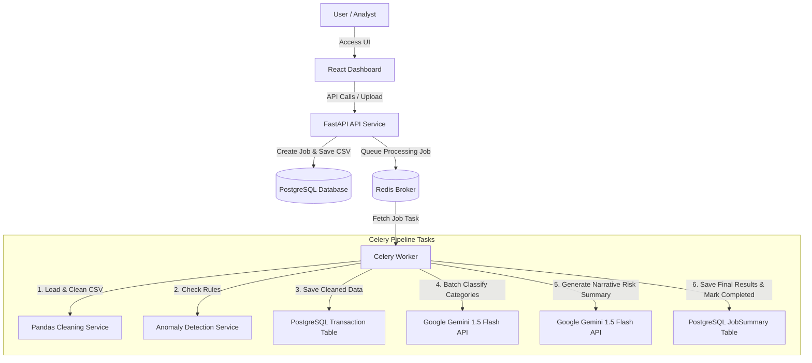

# AI-Powered Transaction Processing Pipeline

A production-ready backend system built using **FastAPI**, **PostgreSQL**, **Redis**, **Celery**, **Pandas**, and **Google Gemini 1.5 Flash API**. 

This system accepts CSV uploads containing financial transactions, processes them asynchronously, cleans/normalizes data, detects rules-based anomalies, runs batch AI classification to fill missing categories, and computes AI narrative spending risk summaries.

---

## Architecture Diagram



---

## Features & Processing Flow

0. **User-Friendly Dashboard**:
   - Clean, light-themed React interface for non-technical users.
   - Real-time status polling for background jobs.
   - Interactive visualization of AI narrative reports and flagged anomalies.

1. **Data Cleaning (Pandas)**:
   - Normalizes date column using multiple formats (`DD-MM-YYYY`, `YYYY/MM/DD`, etc.) to standard ISO format (`YYYY-MM-DD`).
   - Removes currency symbols (e.g. `$500` -> `500`) and converts amounts to floating-point numbers.
   - Normalizes uppercase/lowercase casing for currencies (e.g. `USD`, `INR`) and transaction statuses (e.g. `completed`).
   - Fills missing categories with `"Uncategorised"`.
   - Performs deduplication of identical rows.
   - Generates stable, hash-based `txn_id` identifiers for rows where the ID is missing.

2. **Anomaly Detection**:
   - **Rule 1**: Outlier spending. Flags transactions that exceed **3x the median** amount of all transactions associated with that specific `account_id` in the batch.
   - **Rule 2**: Cross-border domestic check. Flags any transaction marked with a `USD` currency when the merchant is a domestic Indian service (`Swiggy`, `Ola`, or `IRCTC`).
   - Appends detailed, descriptive reasons for all flagged items.

3. **Batch AI Classification (Gemini 1.5 Flash)**:
   - Extracts all transactions labeled `"Uncategorised"`.
   - Packages transactions into batches (default size: `20`) to avoid API rate limits and minimize costs.
   - Calls Gemini once per batch to classify items into: `Food`, `Shopping`, `Travel`, `Transport`, `Utilities`, `Cash Withdrawal`, `Entertainment`, or `Other`, returning a structured JSON map.
   - Records the raw JSON response block and tracks `llm_failed` status per transaction.

4. **AI Summary & Risk Assessment (Gemini 1.5 Flash)**:
   - Aggregates overall figures (spend by currency, top 3 merchants, anomaly counts).
   - Conversions: Converts currency values into INR and USD totals using a default rate of `1 USD = 83 INR`.
   - Calls Gemini to write a professional audit narrative analyzing the spending behavior and outputs a final overall risk level assessment (`low`, `medium`, or `high`).

---

## Project Structure

```text
├── app/                          # Backend FastAPI Source
├── frontend/                     # React + Vite Dashboard Source
├── alembic/                      # Database migrations
├── Dockerfile                    # Backend Docker configuration
├── docker-compose.yml            # Full system orchestration
├── .env                          # Local environment variables
└── README.md                     # Project documentation
```

---

## Deployment & Setup

### Prerequisites
- Docker & Docker Compose installed on your system.
- A **Google Gemini API Key** (Get one from [Google AI Studio](https://aistudio.google.com/)).

### Step 1: Configure Environment Variables
Open the `.env` file in the root directory and update your Gemini API key:
```env
GEMINI_API_KEY=Enter_your_Key_Here
```

### Step 2: Build and Launch Services
Run the following single command in your terminal to build and start the entire pipeline stack:
```bash
docker compose up --build
```

This starts:
1. **Frontend Dashboard** ([http://localhost:3000](http://localhost:3000))
2. **FastAPI Backend** ([http://localhost:8000/docs](http://localhost:8000/docs))
3. **PostgreSQL** (Database)
4. **Redis** (Task Broker)
5. **Celery Worker** (Background Processor)

---

## Interactive Interfaces
- **UI Dashboard**: [http://localhost:3000](http://localhost:3000)
- **API Swagger UI**: [http://localhost:8000/docs](http://localhost:8000/docs)
- **API Redoc**: [http://localhost:8000/redoc](http://localhost:8000/redoc)

---

## Example API Curl Commands

### 1. Upload a CSV File
Uploads a CSV file of transactions to start the asynchronous pipeline. Returns a `job_id` immediately.

```bash
curl -X POST "http://localhost:8000/jobs/upload" \
  -F "file=@transactions.csv"
```

**Example Response**:
```json
{
  "id": "497f6eca-6276-4993-bfeb-53cbbbba6f08",
  "filename": "transactions.csv",
  "status": "pending",
  "row_count_raw": null,
  "row_count_clean": null,
  "created_at": "2026-06-10T20:15:30.123456",
  "completed_at": null,
  "error_message": null
}
```

### 2. Check Job Status
Returns the status (`pending`, `processing`, `completed`, `failed`) and embeds the AI summary report if completed.

```bash
curl -X GET "http://localhost:8000/jobs/497f6eca-6276-4993-bfeb-53cbbbba6f08/status"
```

**Example Response**:
```json
{
  "job": {
    "id": "497f6eca-6276-4993-bfeb-53cbbbba6f08",
    "filename": "transactions.csv",
    "status": "completed",
    "row_count_raw": 5,
    "row_count_clean": 4,
    "created_at": "2026-06-10T20:15:30.123456",
    "completed_at": "2026-06-10T20:15:45.654321",
    "error_message": null
  },
  "summary": {
    "id": "a98b7c6d-e5f4-3d2c-1b0a-9f8e7d6c5b4a",
    "job_id": "497f6eca-6276-4993-bfeb-53cbbbba6f08",
    "total_spend_inr": 85500.00,
    "total_spend_usd": 1030.12,
    "top_merchants": ["Amazon", "Apple Store", "Swiggy"],
    "anomaly_count": 1,
    "narrative": "Spending is primarily concentrated on technology purchases and food orders, with Apple Store being the largest expense. A risk assessment highlights one domestic anomaly: a USD transaction from Swiggy, indicating potential routing irregularities. Overall risk is categorized as low due to the single occurrence.",
    "risk_level": "low"
  }
}
```

### 3. Fetch Job Results
Returns transaction data splits: normal cleaned records, flagged anomalies, count breakdown by categories, and the AI narrative summary.

```bash
curl -X GET "http://localhost:8000/jobs/497f6eca-6276-4993-bfeb-53cbbbba6f08/results"
```

**Example Response**:
```json
{
  "cleaned_transactions": [
    {
      "id": "7d9e8f7a-6b5c-4d3e-2f1a-0b9c8d7e6f5a",
      "job_id": "497f6eca-6276-4993-bfeb-53cbbbba6f08",
      "txn_id": "TXN-001",
      "date": "2026-06-01",
      "merchant": "Amazon",
      "amount": 2500.00,
      "currency": "INR",
      "status": "completed",
      "category": "Shopping",
      "account_id": "ACC-789",
      "notes": "Office supplies",
      "is_anomaly": false,
      "anomaly_reason": null,
      "llm_category": null,
      "llm_raw_response": null,
      "llm_failed": false
    }
  ],
  "anomalies": [
    {
      "id": "0a9b8c7d-6e5f-4d3c-2b1a-0f9e8d7c6b5a",
      "job_id": "497f6eca-6276-4993-bfeb-53cbbbba6f08",
      "txn_id": "TXN-003",
      "date": "2026-06-03",
      "merchant": "Swiggy",
      "amount": 12.50,
      "currency": "USD",
      "status": "completed",
      "category": "Uncategorised",
      "account_id": "ACC-789",
      "notes": null,
      "is_anomaly": true,
      "anomaly_reason": "USD transaction detected for domestic merchant: Swiggy.",
      "llm_category": "Food",
      "llm_raw_response": "{ \"TXN-003\": \"Food\" }",
      "llm_failed": false
    }
  ],
  "category_breakdown": {
    "Shopping": 1,
    "Food": 1
  },
  "ai_summary": {
    "id": "a98b7c6d-e5f4-3d2c-1b0a-9f8e7d6c5b4a",
    "job_id": "497f6eca-6276-4993-bfeb-53cbbbba6f08",
    "total_spend_inr": 85500.00,
    "total_spend_usd": 1030.12,
    "top_merchants": ["Amazon", "Apple Store", "Swiggy"],
    "anomaly_count": 1,
    "narrative": "Spending is primarily concentrated on technology purchases and food orders, with Apple Store being the largest expense. A risk assessment highlights one domestic anomaly: a USD transaction from Swiggy, indicating potential routing irregularities. Overall risk is categorized as low due to the single occurrence.",
    "risk_level": "low"
  }
}
```

### 4. List All Jobs
Lists transaction files uploaded to the service, optionally filtered by status.

```bash
curl -X GET "http://localhost:8000/jobs?status=completed"
```

---

## Test CSV Format Example
Save the following content as `transactions.csv` to run uploads and test your setup:

```csv
txn_id,date,merchant,amount,currency,status,category,account_id,notes
TXN-901,10-06-2026,Amazon,12000,INR,completed,Shopping,ACC-101,Office equipment
TXN-902,2026/06/02,Swiggy,$25,USD,completed,,ACC-101,Dinner out
TXN-903,03/06/2026,Ola,150,INR,completed,Transport,ACC-101,Commute to work
TXN-904,04-06-2026,IRCTC,450,INR,completed,Travel,ACC-102,Train ticket
TXN-905,05-06-2026,Amazon,150000,INR,completed,Shopping,ACC-101,Bulk laptop purchase
,06-06-2026,Rent Payment,18000,INR,completed,,ACC-102,Monthly rent
TXN-901,10-06-2026,Amazon,12000,INR,completed,Shopping,ACC-101,Office equipment
```

*Notes on how this sample tests specific pipeline logic:*
- `TXN-901` is duplicated at the end and will be cleaned/deduplicated.
- `TXN-902` features an amount with currency symbol (`$25`), which will be cleaned to `25.0`, and represents a domestic merchant (`Swiggy`) with `USD` currency, which will flag it as an anomaly.
- `TXN-902` has a blank category and will be automatically classified by Gemini as `"Food"`.
- `TXN-905` features an amount (`150,000`) that is much higher than other transactions for account `ACC-101`, flagging it as a Rule 1 outlier (amount > 3x median).
- Row 6 has a missing transaction ID (`txn_id`) and will have one generated automatically, and its blank category will be classified by Gemini as `"Utilities"` or `"Other"`.
- Date column contains mixed formats (`DD-MM-YYYY`, `YYYY/MM/DD`, `DD/MM/YYYY`), all of which will be parsed to `YYYY-MM-DD` ISO strings.
